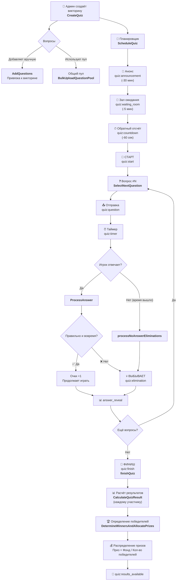

# 📋 Бизнес-логика викторины — Полный справочник функций

> **Дата:** 10.02.2026  
> **Версия:** актуальная (по коду на ВМ)  
> **Назначение:** описание ВСЕХ функций, связанных с викториной, простым языком

---

## 📖 Оглавление

1. [Сущности (что хранится в базе)](#1-сущности)
2. [Управление викториной (CRUD)](#2-управление-викториной)
3. [Планировщик (Scheduler)](#3-планировщик)
4. [Менеджер вопросов (QuestionManager)](#4-менеджер-вопросов)
5. [Адаптивная система сложности](#5-адаптивная-система-сложности)
6. [Обработчик ответов (AnswerProcessor)](#6-обработчик-ответов)
7. [Координатор викторины (QuizManager)](#7-координатор-викторины)
8. [Результаты и призы (ResultService)](#8-результаты-и-призы)
9. [WebSocket — общение с игроками в реальном времени](#9-websocket)
10. [Пул вопросов (админ-функции)](#10-пул-вопросов)
11. [Полная последовательность: от создания до призов](#11-полная-последовательность)

---

## 1. Сущности

Это «модели данных» — то, что хранится в таблицах базы данных.

### Quiz (Викторина)
| Поле | Описание |
|------|----------|
| `ID` | Уникальный номер викторины |
| `Title` | Название (макс. 100 символов) |
| `Description` | Описание (макс. 500 символов) |
| `ScheduledTime` | Дата/время начала |
| `Status` | Текущий статус: `scheduled`, `in_progress`, `completed`, `cancelled` |
| `QuestionCount` | Количество вопросов |
| `PrizeFund` | Призовой фонд (по умолчанию 1 000 000 ₸) |

**Методы:**
- **`IsActive()`** — возвращает `true`, если викторина сейчас идёт (`in_progress`)
- **`IsScheduled()`** — возвращает `true`, если викторина запланирована
- **`IsCompleted()`** — возвращает `true`, если викторина завершена

---

### Question (Вопрос)
| Поле | Описание |
|------|----------|
| `ID` | Уникальный номер вопроса |
| `QuizID` | К какой викторине привязан. Если `NULL` — вопрос из **общего пула** |
| `Text` | Текст вопроса (русский) |
| `TextKK` | Текст вопроса (казахский, опционально) |
| `Options` | Варианты ответов (русский), хранятся в JSONB |
| `OptionsKK` | Варианты ответов (казахский, опционально) |
| `CorrectOption` | Индекс правильного ответа (0, 1, 2...). **Скрыт от клиента** |
| `TimeLimitSec` | Лимит времени на ответ в секундах (по умолчанию 10) |
| `PointValue` | Очки за правильный ответ (по умолчанию 10) |
| `Difficulty` | Сложность от 1 до 5 (1 = очень легко, 5 = очень сложно) |
| `IsUsed` | Флаг: использован ли вопрос ранее (для пула) |

**Методы:**
- **`IsCorrect(selectedOption)`** — проверяет, совпадает ли выбранный вариант с правильным
- **`CalculatePoints(isCorrect, responseTimeMs)`** — возвращает 1 за правильный ответ, 0 за неправильный
- **`IsValidOption(selectedOption)`** — проверяет, что индекс опции в допустимых пределах
- **`GetLocalizedText(lang)`** — возвращает текст на нужном языке (`"kk"` → казахский, иначе русский)
- **`GetLocalizedOptions(lang)`** — аналогично для вариантов ответа

---

### UserAnswer (Ответ пользователя)
| Поле | Описание |
|------|----------|
| `UserID` | Кто ответил |
| `QuizID` | В какой викторине |
| `QuestionID` | На какой вопрос |
| `SelectedOption` | Какой вариант выбрал (`-1` = не ответил) |
| `IsCorrect` | Правильно ли |
| `ResponseTimeMs` | Время ответа в миллисекундах |
| `Score` | Полученные очки |
| `IsEliminated` | Выбыл ли после этого ответа |
| `EliminationReason` | Причина выбытия (`incorrect_answer`, `time_exceeded`, `no_answer_timeout`) |

---

### Result (Итоговый результат)
| Поле | Описание |
|------|----------|
| `UserID` / `QuizID` | Связь пользователь ↔ викторина (уникальная пара) |
| `Username` | Имя пользователя |
| `Score` | Итоговый счёт |
| `CorrectAnswers` | Число правильных ответов |
| `TotalQuestions` | Всего вопросов в викторине |
| `Rank` | Место в рейтинге |
| `IsWinner` | Победитель или нет |
| `PrizeFund` | Приз этому игроку (₸) |
| `IsEliminated` | Выбыл ли |
| `EliminatedOnQuestion` | На каком вопросе выбыл |
| `EliminationReason` | Почему выбыл |

---

## 2. Управление викториной

Файл: [quiz_service.go](file:///c:/project/vmdeploy/trivia-api/internal/service/quiz_service.go)

### `CreateQuiz(title, description, scheduledTime, prizeFund)`
- **Что делает:** Создаёт новую викторину в базе данных.
- **Как работает:**
  1. Проверяет, что время старта — в будущем
  2. Если `prizeFund` не указан или ≤ 0 — ставит дефолт из конфига (1 000 000 ₸)
  3. Устанавливает статус `scheduled`, `QuestionCount = 0`
  4. Сохраняет в БД и возвращает созданную викторину

### `AddQuestions(quizID, questions)`
- **Что делает:** Добавляет вопросы к конкретной викторине (админом вручную).
- **Как работает:**
  1. Проверяет, что викторина существует и в статусе `scheduled`
  2. Считает уже имеющиеся вопросы + новые; если превышает лимит (10 по умолчанию) → ошибка
  3. Привязывает каждый вопрос к викторине через `QuizID`
  4. Сохраняет пакетом в БД и обновляет счётчик `QuestionCount`

### `ScheduleQuiz(quizID, scheduledTime)`
- **Что делает:** Меняет время начала викторины.
- **Как работает:**
  1. Проверяет, что время в будущем
  2. Обновляет `ScheduledTime`
  3. Если викторина была `completed` — автоматически меняет статус на `scheduled` (повторный запуск)

### `DuplicateQuiz(originalQuizID, newScheduledTime)`
- **Что делает:** Создаёт копию существующей викторины с новым временем.
- **Как работает:**
  1. Загружает оригинал со всеми вопросами
  2. Проверяет, что у оригинала есть вопросы и новое время в будущем
  3. **В транзакции:** создаёт новую викторину → копирует все вопросы (включая сложность и казахский перевод)
  4. Поле `IsUsed` у копий сбрасывается — они считаются новыми
  5. Название: оригинал + ` (Копия)`, с обрезкой до 100 символов

### `DeleteQuiz(quizID)`
- **Что делает:** Удаляет викторину.
- **Как работает:** Проверяет, что викторина **не активна** (`in_progress`), затем удаляет.

### `GetQuizByID` / `GetActiveQuiz` / `GetScheduledQuizzes` / `ListQuizzes` / `ListQuizzesWithFilters`
- **Что делают:** Запросы на чтение — получение викторины по ID, активной, запланированных, списка с пагинацией и фильтрацией (по статусу, поиску, датам).

---

## 3. Планировщик

Файл: [scheduler.go](file:///c:/project/vmdeploy/trivia-api/internal/service/quizmanager/scheduler.go)

Отвечает за таймеры: когда что отправить игрокам перед началом и при старте.

### `ScheduleQuiz(ctx, quizID, scheduledTime)`
- **Что делает:** Планирует запуск викторины — ставит таймеры на анонс, зал ожидания, обратный отсчёт и старт.
- **Как работает:**
  1. Проверяет, что время в будущем
  2. Загружает викторину с вопросами
  3. Если вопросов нет — проверяет, есть ли общий пул. Если пул тоже пуст → ошибка
  4. Если уже был запланирован старый таймер — отменяет его
  5. Создаёт новый контекст с уникальным токеном (защита от двойного запуска)
  6. Запускает `runQuizSequence` в фоне

### `CancelQuiz(quizID)`
- **Что делает:** Отменяет запланированную викторину.
- **Как работает:**
  1. Проверяет, что викторина в статусе `scheduled`
  2. Отменяет таймер (если есть)
  3. Меняет статус в БД на `cancelled`
  4. Рассылает всем событие `quiz:cancelled`

### `runQuizSequence(ctx, quiz, token)`
- **Что делает:** Главная последовательность событий перед викториной.
- **Как работает (по порядку):**

| Время | Событие | Функция |
|-------|---------|---------|
| **За 30 мин** до начала | 📢 Анонс | `triggerAnnouncement` — рассылает `quiz:announcement` |
| **За 5 мин** до начала | 🚪 Зал ожидания | `triggerWaitingRoom` — рассылает `quiz:waiting_room` |
| **За 60 сек** до начала | ⏱ Обратный отсчёт | `triggerCountdown` — каждую секунду рассылает `quiz:countdown` |
| **В точное время** | 🚀 Старт | `triggerQuizStart` — меняет статус на `in_progress`, рассылает `quiz:start`, отправляет сигнал в `QuizManager` |

Если на любом этапе контекст отменён (например, викторину отменили) — последовательность прерывается.

### `hasPoolQuestions()`
- **Что делает:** Проверяет, есть ли хотя бы один вопрос в общем пуле (по каждому уровню сложности от 1 до 5).

---

## 4. Менеджер вопросов

Файл: [question_manager.go](file:///c:/project/vmdeploy/trivia-api/internal/service/quizmanager/question_manager.go)

Отвечает за **доставку вопросов** игрокам во время викторины.

### `RunQuizQuestions(ctx, quizState)`
- **Что делает:** Основной цикл: берёт вопросы один за другим и отправляет игрокам.
- **Как работает (для каждого из 10 вопросов):**
  1. **Адаптивный выбор** — вызывает `SelectNextQuestion` для получения вопроса нужной сложности
  2. Добавляет вопрос в список использованных (`usedQuestionIDs`)
  3. Устанавливает текущий вопрос в состояние викторины
  4. Ждёт короткую задержку (`QuestionDelayMs` = 500мс) для синхронизации с фронтендом
  5. Фиксирует точное время отправки (`sendTimeMs`)
  6. **Рассылает `quiz:question`** — вопрос со всеми вариантами ответов (включая казахский перевод), лимитом времени и номером
  7. Сохраняет время старта вопроса в Redis (`question:{id}:start_time`)
  8. Запускает таймер вопроса (`runQuestionTimer`)
  9. **Ждёт `timeLimitSec` секунд** — это время на ответ
  10. **Проверка не ответивших** — вызывает `processNoAnswerEliminations`
  11. Отправляет `adaptive:question_stats` — статистика для мониторинга
  12. Ждёт задержку (`AnswerRevealDelayMs` = 200мс)
  13. **Рассылает `quiz:answer_reveal`** — правильный ответ
  14. Проверяет рекламный слот (`processAdBreak`)
  15. Пауза между вопросами (`InterQuestionDelayMs` = 500мс)
  16. Переходит к следующему вопросу

**После всех вопросов:**
- Помечает все использованные вопросы как `IsUsed = true` в БД
- Очищает текущий вопрос из состояния
- Отправляет сигнал `questionDoneCh` → `QuizManager` запускает `finishQuiz`

### `processNoAnswerEliminations(ctx, quizState, question, questionNumber)`
- **Что делает:** Выбивает игроков, которые **не ответили** на вопрос.
- **Как работает:**
  1. Получает список всех участников из Redis Set (`quiz:{id}:participants`)
  2. Для каждого участника проверяет:
     - Есть ли ключ ответа (`quiz:{quizID}:user:{userID}:question:{questionID}`) → **ответил**
     - Есть ли ключ выбывания (`quiz:{quizID}:eliminated:{userID}`) → **уже выбыл раньше**
  3. Если не ответил и ещё не выбыл:
     - Создаёт запись `UserAnswer` с `SelectedOption = -1`, `IsEliminated = true`, `EliminationReason = "no_answer_timeout"`
     - Ставит ключ выбывания в Redis
     - Отправляет `quiz:elimination` лично игроку
     - Записывает статистику для адаптивной системы (не прошёл)

### `processAdBreak(ctx, quizState, questionNumber, totalQuestions)`
- **Что делает:** Показывает рекламу между вопросами (если настроена).
- **Как работает:**
  1. Проверяет, есть ли рекламный слот для данного вопроса в БД
  2. Если есть и активен → отправляет `quiz:ad_break` (тип медиа, URL, длительность)
  3. Ждёт заданное время показа рекламы
  4. Отправляет `quiz:ad_break_end`

### `runQuestionTimer(ctx, quiz, question, questionNumber, endTime, wg)`
- **Что делает:** Каждую секунду рассылает `quiz:timer` — сколько секунд осталось на ответ.
- **Как работает:** Тикер каждую секунду → вычисляет `remaining_seconds` → рассылает событие → останавливается когда время вышло.

### `sendEventWithRetry(ctx, quizID, eventType, data)`
- **Что делает:** Надёжная отправка события через WebSocket с повторными попытками (до 3 раз с паузой 500мс).

---

## 5. Адаптивная система сложности

Файлы:
- [adaptive_selector.go](file:///c:/project/vmdeploy/trivia-api/internal/service/quizmanager/adaptive_selector.go)
- [difficulty_config.go](file:///c:/project/vmdeploy/trivia-api/internal/service/quizmanager/difficulty_config.go)

Система, которая **автоматически подбирает сложность** следующего вопроса на основе того, сколько людей прошли предыдущий.

### Настройки по умолчанию (`DefaultDifficultyConfig`)

**Целевые pass rate** (сколько % игроков должны пройти каждый вопрос):

| Вопрос | Целевой % | Базовая сложность |
|--------|-----------|-------------------|
| Q1 | 90% | 1 (Очень легко) |
| Q2 | 85% | 2 (Легко) |
| Q3 | 78% | 2 (Легко) |
| Q4 | 70% | 3 (Средне) |
| Q5 | 62% | 3 (Средне) |
| Q6 | 55% | 4 (Сложно) |
| Q7 | 48% | 4 (Сложно) |
| Q8 | 42% | 5 (Очень сложно) |
| Q9 | 36% | 5 (Очень сложно) |
| Q10 | 50% | 5 (Очень сложно) |

> 📊 Произведение всех pass rate ≈ **0.52%** — то есть из 1000 игроков до конца дойдут примерно 5.

**Порог адаптации:** 10% (`AdaptationThreshold = 0.10`)

### `SelectNextQuestion(ctx, quizID, questionNumber, usedQuestionIDs)`
- **Что делает:** Выбирает следующий вопрос, учитывая реальную статистику.
- **Как работает:**
  1. Получает **реальный pass rate** предыдущего вопроса из Redis
  2. Вычисляет нужную сложность через `CalculateAdjustedDifficulty`
  3. Ищет вопрос гибридно: **сначала среди вопросов викторины**, потом **из общего пула**
  4. Если не нашёл — **fallback** на другие уровни сложности

### `CalculateAdjustedDifficulty(questionNumber, actualPassRate)`
- **Что делает:** Корректирует сложность на ±1 на основе отклонения.
- **Логика:**
  - Если реальный % прохождения **на 10%+ выше** целевого → **+1 к сложности** (вопрос сложнее)
  - Если реальный % прохождения **на 10%+ ниже** целевого → **-1 к сложности** (вопрос легче)
  - Если в пределах порога → базовая сложность без изменений
  - Для первого вопроса — всегда базовая сложность (нет предыдущих данных)

### `getActualPassRate(quizID, questionNumber)`
- **Что делает:** Читает из Redis реальный процент прохождения предыдущего вопроса.
- **Как работает:** Берёт ключи `quiz:{id}:q{N}:total` и `quiz:{id}:q{N}:passed`, делит `passed / total`.
- **Возвращает:** `-1.0` если данных нет, `0.0...1.0` — реальный %, `1.0` — для первого вопроса.

### `findQuestionByDifficultyHybrid(quizID, difficulty, excludeIDs)`
- **Что делает:** Ищет вопрос нужной сложности.
- **Приоритет:**
  1. Сначала среди вопросов, **привязанных к викторине** (добавленных админом)
  2. Затем из **общего пула** (с `QuizID = NULL` и `IsUsed = false`)

### `findQuestionWithFallbackHybrid(quizID, targetDifficulty, excludeIDs)`
- **Что делает:** Если нет вопроса нужной сложности — ищет на соседних уровнях.
- **Порядок:** При `FallbackToHigher = true`: сначала вверх (сложнее 4→5), потом вниз (3→2→1).

### `RecordQuestionResult(quizID, questionNumber, passed)`
- **Что делает:** Записывает результат ответа в Redis для следующей адаптации.
- **Как работает:** Инкрементирует `quiz:{id}:q{N}:total` и (если прошёл) `quiz:{id}:q{N}:passed`.

---

## 6. Обработчик ответов

Файл: [answer_processor.go](file:///c:/project/vmdeploy/trivia-api/internal/service/quizmanager/answer_processor.go)

### `ProcessAnswer(ctx, userID, question, selectedOption, timestamp, quizState, questionStartTimeMs)`
- **Что делает:** Обрабатывает ответ от игрока — THE CORE of the game.
- **Как работает пошагово:**

  **Шаг 1 — Проверка выбывания:**
  - Ключ Redis `quiz:{quizID}:eliminated:{userID}` — если существует → ответ отклоняется, игроку шлём `quiz:elimination` с причиной `already_eliminated`

  **Шаг 2 — Расчёт времени:**
  - Берёт время начала вопроса (из состояния или fallback из Redis)
  - Вычисляет `responseTimeMs = текущее_время – время_начала_вопроса`
  - Проверяет, не превышен ли лимит: `responseTimeMs > timeLimitSec × 1000`

  **Шаг 3 — Проверка ответа:**
  - Вызывает `question.IsCorrect(selectedOption)` — правильно или нет
  - Вычисляет очки: `question.CalculatePoints(...)` → 1 за правильный, 0 за неправильный

  **Шаг 4 — Решение о выбытии:**
  - Игрок **выбывает**, если:
    - ❌ **Неправильный ответ** → причина `incorrect_answer`
    - ⏰ **Превышен лимит времени** → причина `time_exceeded`

  **Шаг 5 — Сохранение в БД:**
  - Создаёт запись `UserAnswer` и сохраняет
  - Если запись-дубль (уникальный ключ) → ошибка «уже ответил»

  **Шаг 6 — Пост-обработка:**
  - Если выбыл → ставит ключ `quiz:{quizID}:eliminated:{userID}` в Redis (на 24 часа)
  - Если выбыл → отправляет `quiz:elimination` лично игроку
  - Ставит ключ «ответил» в Redis: `quiz:{quizID}:user:{userID}:question:{questionID}`
  - Записывает статистику для адаптивной системы
  - Отправляет `quiz:answer_result` лично игроку с полной информацией

### `HandleReadyEvent(ctx, userID, quizID)`
- **Что делает:** Регистрирует игрока как «готового» к викторине.
- **Как работает:**
  1. Ставит ключ готовности в Redis
  2. **Добавляет юзера в Redis Set** `quiz:{quizID}:participants` — этот Set используется для проверки выбывания (вместо WebSocket — чтобы отключённые игроки тоже учитывались!)
  3. Рассылает `quiz:user_ready` всем участникам с текущим количеством игроков

### `GetUserQuizStatus(ctx, userID, quizID)`
- **Что делает:** Возвращает текущий статус игрока для ресинхронизации (после переподключения).
- **Как работает:**
  1. Проверяет ключ выбывания в Redis
  2. Загружает ответы из БД → считает очки и правильные ответы
  3. Возвращает: `IsEliminated`, `EliminationReason`, `Score`, `CorrectCount`

---

## 7. Координатор викторины

Файл: [quiz_manager.go](file:///c:/project/vmdeploy/trivia-api/internal/service/quiz_manager.go)

Координирует все компоненты: Scheduler, QuestionManager, AnswerProcessor.

### `handleEvents()` (фоновый слушатель)
- **Что делает:** Слушает два канала:
  - `quizStartCh` ← от Scheduler: «Викторина #N стартует!» → запускает `handleQuizStart`
  - `questionDoneCh` ← от QuestionManager: «Все вопросы заданы!» → запускает `finishQuiz`

### `handleQuizStart(quizID)`
- **Что делает:** Инициализирует активную викторину.
- **Как работает:**
  1. Загружает викторину с вопросами из БД
  2. Если вопросов нет — работает в адаптивном режиме (вопросы из пула)
  3. Создаёт `ActiveQuizState` — объект-состояние текущей викторины
  4. Проверяет, нет ли уже другой активной викторины (защита от двойного запуска)
  5. Запускает `QuestionManager.RunQuizQuestions` в горутине

### `finishQuiz(quizID)`
- **Что делает:** Завершает викторину и запускает подсчёт результатов.
- **Как работает:**
  1. **Под lock:** Проверяет, что это текущая активная викторина → ставит статус `completed` → сбрасывает `activeQuizState = nil`
  2. **Без lock:** Обновляет статус в БД
  3. Рассылает `quiz:finish` всем участникам
  4. Получает список участников из Redis Set `quiz:{quizID}:participants`
  5. **Параллельно** для каждого участника вызывает `CalculateQuizResult` (подсчёт индивидуального результата)
  6. Ждёт завершения всех расчётов (`WaitGroup`)
  7. Вызывает `DetermineWinnersAndAllocatePrizes` — определение победителей и распределение призов

### `ProcessAnswer(userID, questionID, selectedOption, timestamp)`
- **Что делает:** Точка входа для обработки ответа (вызывается из WebSocket).
- **Как работает:**
  1. Получает текущее состояние викторины (под RLock)
  2. Проверяет, что текущий вопрос совпадает с вопросом из ответа
  3. Получает время начала вопроса
  4. Делегирует в `AnswerProcessor.ProcessAnswer`

### `GetCurrentState(userID, quizID)`
- **Что делает:** Resync — возвращает полное состояние для игрока после переподключения.
- **Как работает:**
  - Если викторина **не активна**: возвращает статус из БД + результат если `completed`
  - Если викторина **активна**: возвращает текущий вопрос, оставшееся время, статус выбывания, очки, количество игроков

---

## 8. Результаты и призы

Файл: [result_service.go](file:///c:/project/vmdeploy/trivia-api/internal/service/result_service.go)

### `CalculateQuizResult(userID, quizID)`
- **Что делает:** Считает итоговый результат одного игрока.
- **Как работает:**
  1. Загружает пользователя, викторину, все ответы
  2. Проверяет статус выбывания в Redis
  3. Суммирует очки и правильные ответы
  4. Находит первый ответ с выбытием → запоминает номер вопроса и причину
  5. **В транзакции:**
     - Создаёт запись `Result`
     - Обновляет `total_score` у пользователя (прибавляет)
     - Обновляет `highest_score` если новый рекорд
     - Увеличивает `games_played` на 1

### `DetermineWinnersAndAllocatePrizes(ctx, quizID)`
- **Что делает:** Определяет победителей и раздаёт призы. THE BIG ONE.
- **Как работает:**
  1. Загружает викторину с вопросами
  2. Определяет количество вопросов (с fallback: привязанные вопросы → уникальные из ответов → `QuestionCount`)
  3. Берёт призовой фонд викторины (fallback на дефолт из конфига)
  4. **В транзакции:**
     - **⚡ `CalculateRanks`** — SQL-запрос `RANK() OVER (ORDER BY score DESC, correct_answers DESC)` — вычисляет место каждого игрока
     - **⚡ `FindAndUpdateWinners`** — ищет победителей: `correct_answers = totalQuestions AND is_eliminated = false`
     - Приз = `prizeFund / количество_победителей` (целочисленное деление)
     - Обновляет `is_winner = true`, `prize_fund` у победителей
     - Сбрасывает `is_winner = false` у остальных
     - Обновляет `wins_count + 1` и `total_prize_won` у пользователей-победителей
  5. Рассылает `quiz:results_available` через WebSocket

> **Кто считается победителем:** только тот, кто **ответил правильно на ВСЕ вопросы** и **не был выбит**.

### `CalculateQuizStatistics(quizID)`
- **Что делает:** Рассчитывает расширенную статистику викторины.
- **Что возвращает:**
  - Всего участников, победителей, выбывших
  - Среднее время ответа, среднее число правильных ответов
  - Выбытия по каждому вопросу (количество, причины, pass rate)
  - Распределение вопросов по сложности (1-5)
  - Количество использованных вопросов из пула
  - Средний pass rate

### `GetQuizResults` / `GetUserResult` / `GetQuizWinners` / `GetQuizResultsAll`
- **Что делают:** Чтение результатов с пагинацией, для конкретного пользователя, списка победителей, полный экспорт.

---

## 9. WebSocket

Файл: [ws_handler.go](file:///c:/project/vmdeploy/trivia-api/internal/handler/ws_handler.go)

### Подключение
- **`HandleConnection`** — клиент подключается с одноразовым WS-тикетом (JWT, 60 сек TTL)
- Проверяет тикет через `ParseWSTicket`
- Создаёт WebSocket-клиента с конфигурацией из `config.yaml`

### Входящие сообщения (от клиента → серверу)

| Тип | Описание | Что вызывает |
|-----|----------|--------------|
| `user:ready` | Игрок зашёл в зал ожидания | `HandleReadyEvent` → подписка на quiz, добавление в participants |
| `user:answer` | Игрок отвечает на вопрос | `ProcessAnswer` → проверка ответа и выбытие |
| `user:heartbeat` | Проверка связи | Возвращает `server:heartbeat` |
| `user:resync` | Восстановление после переподключения | `GetCurrentState` → отправка текущего состояния |

### Исходящие сообщения (сервер → клиенту)

| Тип | Когда | Кому |
|-----|-------|------|
| `quiz:announcement` | За 30 мин до старта | Всем подписанным |
| `quiz:waiting_room` | За 5 мин до старта | Всем подписанным |
| `quiz:countdown` | За 60 сек, каждую секунду | Всем подписанным |
| `quiz:start` | Момент старта | Всем подписанным |
| `quiz:question` | Новый вопрос | Всем подписанным |
| `quiz:timer` | Каждую секунду во время вопроса | Всем подписанным |
| `quiz:answer_result` | После обработки ответа | Лично игроку |
| `quiz:answer_reveal` | Правильный ответ | Всем подписанным |
| `quiz:elimination` | Игрок выбыл | Лично игроку |
| `quiz:user_ready` | Кто-то зашёл в зал ожидания | Всем подписанным |
| `quiz:ad_break` / `quiz:ad_break_end` | Рекламная пауза | Всем подписанным |
| `quiz:finish` | Викторина завершена | Всем подписанным |
| `quiz:results_available` | Результаты готовы | Всем подписанным |
| `quiz:state` | Ответ на resync | Лично игроку |
| `quiz:cancelled` | Викторина отменена | Всем |
| `adaptive:question_stats` | Статистика после вопроса | Всем подписанным |

---

## 10. Пул вопросов

### `BulkUploadQuestionPool(questions)`
- **Что делает:** Массовая загрузка вопросов в общий пул (для адаптивной системы).
- **Как работает:**
  1. Проверяет каждый вопрос: `Difficulty` от 1 до 5, `CorrectOption` корректен
  2. Вопросы сохраняются с `QuizID = nil` (не привязаны к викторине)
  3. Сохраняет пакетом в БД

### `GetPoolStats()`
- **Что делает:** Показывает статистику пула.
- **Возвращает:** всего вопросов, использованных, доступных, распределение по сложности.

### `ResetPoolUsed()`
- **Что делает:** Сбрасывает флаг `IsUsed = false` для всех вопросов пула.
- **Когда использовать:** Когда закончились неиспользованные вопросы и нужно «переиграть» пул.

---

## 11. Полная последовательность: от создания до призов

### Причины выбытия (полный список)

| Причина | Код | Когда |
|---------|-----|-------|
| Неправильный ответ | `incorrect_answer` | Игрок выбрал не тот вариант |
| Превышен лимит времени | `time_exceeded` | Ответил правильно, но позже дедлайна |
| Не ответил | `no_answer_timeout` | Вообще не прислал ответ за время вопроса |
| Отключился | `disconnected` | (отслеживается в статистике) |

### Ключи Redis (во время викторины)

| Ключ | Зачем | TTL |
|------|-------|-----|
| `quiz:{id}:participants` | Set всех участников | 24 ч |
| `quiz:{id}:eliminated:{userID}` | Флаг выбывания | 24 ч |
| `quiz:{id}:user:{userID}:question:{questionID}` | Ответил ли на вопрос | 1 ч |
| `question:{id}:start_time` | Время начала вопроса | 1 ч |
| `quiz:{id}:q{N}:total` | Сколько людей отвечали (адаптивная) | — |
| `quiz:{id}:q{N}:passed` | Сколько людей прошли (адаптивная) | — |

### Конфигурация по умолчанию

| Параметр | Значение |
|----------|----------|
| Макс. вопросов | 10 |
| Призовой фонд | 1 000 000 ₸ |
| Анонс до старта | 30 мин |
| Зал ожидания | 5 мин |
| Обратный отсчёт | 60 сек |
| Задержка перед вопросом | 500 мс |
| Задержка перед ответом | 200 мс |
| Пауза между вопросами | 500 мс |
| Макс. время ответа | 30 сек |
| Лимит на выбывание | 10 сек |
| Повторные попытки отправки | 3 |
