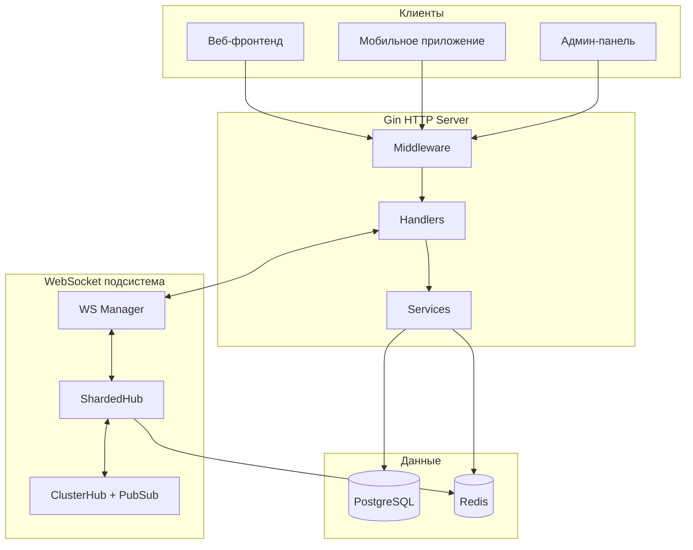

# Trivia API Backend — База знаний

> Документ служит справочником для агентов, работающих с бэкендом Trivia API.

---

## 1. Назначение системы

Платформа для проведения онлайн-викторин в реальном времени:
- JWT-аутентификация с ротацией ключей и CSRF-защитой
- WebSocket для live-геймплея (10k+ одновременных пользователей)
- Планирование викторин с автоматической доставкой вопросов
- Система призов с рангами и лидербордом
- Админ-панель для управления викторинами/пользователями/рекламой

---

## 2. Архитектура



### Ответственность слоёв

| Слой | Файлы | Назначение |
|------|-------|------------|
| **Handlers** | `internal/handler/*.go` | HTTP-обработка, валидация, форматирование ответов |
| **Services** | `internal/service/*.go` | Бизнес-логика, оркестрация, транзакции |
| **Repositories** | `internal/repository/postgres/*.go`, `redis/*.go` | Доступ к данным, GORM, кэширование |
| **Entities** | `internal/domain/entity/*.go` | Доменные модели с GORM-тегами |
| **WebSocket** | `internal/websocket/*.go` | Real-time, шардирование, кластеризация |
| **Middleware** | `internal/middleware/*.go` | Auth, CSRF, валидация параметров |
| **Pkg/Auth** | `pkg/auth/*.go`, `pkg/auth/manager/*.go` | JWT, жизненный цикл токенов, ротация ключей |

---

## 3. Структура каталогов и статистика файлов

**Общая статистика:** 117 файлов в trivia-api

| Директория | Файлов | Описание |
|------------|--------|----------|
| `cmd/api/` | 1 | main.go — точка входа |
| `cmd/fix-db/` | 1 | Утилита исправления БД |
| `config/` | 1 | config.yaml |
| `internal/config/` | 1 | Загрузка конфига (Viper) |
| `internal/domain/entity/` | 12 | Сущности + тесты |
| `internal/domain/repository/` | 10 | Интерфейсы репозиториев |
| `internal/handler/` | 5 | HTTP handlers |
| `internal/handler/dto/` | 2 | Response DTOs |
| `internal/handler/helper/` | 1 | Хелперы |
| `internal/middleware/` | 2 | Auth, param middleware |
| `internal/pkg/errors/` | 1 | apperrors |
| `internal/repository/postgres/` | 9 | GORM-реализации |
| `internal/repository/redis/` | 1 | Redis-кэш |
| `internal/service/` | 12 | Бизнес-логика + тесты |
| `internal/service/quizmanager/` | 6 | Компоненты QuizManager |
| `internal/websocket/` | 9 | WS-клиент, hub, manager |
| `migrations/` | 32 | SQL-миграции (16 пар) |
| `pkg/auth/` | 1 | jwt.go (662 строки) |
| `pkg/auth/manager/` | 1 | token_manager.go (860 строк) |
| `pkg/database/` | 2 | Хелперы подключения |
| корень | 6 | Dockerfile, docker-compose.yml, Makefile, go.mod/sum, README |

---

## 4. Ключевые компоненты

### 4.1 Аутентификация (`pkg/auth/`, `internal/service/auth_service.go`)

**Поток:**
1. **Логин** → `AuthHandler.Login` → `AuthService.LoginUser` → `TokenManager.GenerateTokenPair`
2. **Обновление токена** → `AuthHandler.RefreshToken` → `TokenManager.RefreshTokens`
3. **Выход** → Отзыв refresh-токена, инвалидация JWT, очистка cookies

**Особенности:**
- JWT с ротирующимися ключами из БД (`jwt_keys`)
- Access-токены: 15-30 мин, HttpOnly cookie
- Refresh-токены: 30 дней, HttpOnly cookie
- CSRF: Double Submit Cookie (секрет в JWT + HttpOnly cookie)
- Лимит сессий на пользователя (по умолчанию 10)

**Методы TokenManager:**
| Метод | Назначение |
|-------|------------|
| `GenerateTokenPair` | Создание access + refresh токенов с CSRF |
| `RefreshTokens` | Ротация токенов, новый CSRF-секрет |
| `RevokeRefreshToken` | Пометить токен как истёкший |
| `RevokeAllUserTokens` | Выход со всех устройств |
| `RotateJWTKeys` | Создание нового ключа подписи |
| `Set*Cookie` | Управление cookies |

### 4.2 WebSocket подсистема (`internal/websocket/`)

**Компоненты:**
- **ShardedHub** (936 строк): Распределение клиентов по N шардам (FNV-хеш)
- **Shard**: Управление подмножеством клиентов, подписки на викторины
- **Manager**: Маршрутизация сообщений, рассылка событий
- **Client**: Одно WS-соединение с read/write pumps
- **ClusterHub**: Redis Pub/Sub для multi-instance

**Типы сообщений (клиент → сервер):**
| Тип | Назначение |
|-----|------------|
| `user:ready` | Подписка на викторину, регистрация участника |
| `user:answer` | Отправка ответа с timestamp |
| `user:heartbeat` | Keep-alive |
| `user:resync` | Получение текущего состояния после реконнекта |

**События (сервер → клиент):**
- `quiz:start`, `quiz:question`, `quiz:answer_result`, `quiz:finish`
- `quiz:player_count`, `quiz:results_available`, `quiz:state`
- `server:error`, `server:heartbeat`

### 4.3 Quiz Manager (`internal/service/quiz_manager.go`, `quizmanager/`)

**Архитектура:**
```
QuizManager (оркестратор)
├── Scheduler        # Планирование, запуск викторин
├── QuestionManager  # Отправка вопросов с таймингом, реклама
└── AnswerProcessor  # Валидация ответов, отслеживание выбывания
```

**Жизненный цикл викторины:**
1. **scheduled** → Викторина создана с будущим временем
2. **in_progress** → Scheduler запускает, вопросы идут через WS
3. **completed** → Расчёт результатов, определение победителей, распределение призов

**Ключевые методы:**
| Метод | Назначение |
|-------|------------|
| `ScheduleQuiz` | Добавить викторину в планировщик |
| `handleQuizStart` | Загрузка викторины, создание state, запуск цикла вопросов |
| `ProcessAnswer` | Делегирование в AnswerProcessor |
| `finishQuiz` | Расчёт результатов, определение победителей |
| `GetCurrentState` | Состояние для resync после реконнекта |

### 4.4 Result Service (`internal/service/result_service.go`)

**Функции:**
- `CalculateQuizResult`: Подсчёт очков пользователя в транзакции
- `DetermineWinnersAndAllocatePrizes`: Ранги, победители, распределение призов
- `CalculateQuizStatistics`: Агрегированная статистика с breakdown по выбыванию

**Логика призов:**
1. Победители = пользователи со всеми правильными ответами (не выбыли)
2. Приз на победителя = `TotalPrizeFund / WinnerCount`
3. Обновления: `results.is_winner`, `results.prize_fund`, `users.wins_count`, `users.total_prize_won`

---

## 5. Модели данных

| Сущность | Таблица | Ключевые поля |
|----------|---------|---------------|
| **User** | `users` | id, username, email, password (bcrypt), language, total_score, wins_count |
| **Quiz** | `quizzes` | id, title, status, scheduled_time, prize_fund, question_count |
| **Question** | `questions` | quiz_id, text, text_kk, options (JSONB), correct_option, time_limit_sec |
| **Result** | `results` | user_id, quiz_id, score, rank, is_winner, is_eliminated, prize_fund |
| **UserAnswer** | `user_answers` | user_id, quiz_id, question_id, selected_option, is_correct, response_time_ms |
| **RefreshToken** | `refresh_tokens` | user_id, token, device_id, ip_address, expires_at, is_expired |
| **JWTKey** | `jwt_keys` | id (kid), key (зашифрован), is_active, expires_at |
| **AdAsset** | `ad_assets` | title, media_type, storage_path, duration_sec |
| **QuizAdSlot** | `quiz_ad_slots` | quiz_id, ad_asset_id, trigger_after_question |

### Статусы викторины
```go
const (
    QuizStatusScheduled  = "scheduled"
    QuizStatusInProgress = "in_progress"
    QuizStatusCompleted  = "completed"
    QuizStatusCancelled  = "cancelled"
)
```

---

## 6. API Endpoints

### Auth (`/api/auth/`)
| Метод | Путь | Auth | CSRF |
|-------|------|------|------|
| POST | `/register` | ✗ | ✗ |
| POST | `/login` | ✗ | ✗ |
| POST | `/refresh` | Cookie | ✗ |
| POST | `/logout` | ✓ | ✓ |
| GET | `/profile` | ✓ | ✗ |
| PUT | `/profile` | ✓ | ✓ |
| GET | `/sessions` | ✓ | ✗ |
| DELETE | `/sessions/:id` | ✓ | ✓ |
| GET | `/csrf-token` | ✓ | ✗ |
| GET | `/ws-ticket` | ✓ | ✗ |

### Quizzes (`/api/quizzes/`)
| Метод | Путь | Auth |
|-------|------|------|
| GET | `/active` | ✗ |
| GET | `/scheduled` | ✗ |
| GET | `/:id` | ✗ |
| GET | `/:id/questions` | Admin |
| GET | `/:id/results` | ✗ |
| GET | `/:id/results/export` | Admin |
| POST | `/` | Admin |
| POST | `/:id/questions` | Admin |
| POST | `/:id/schedule` | Admin |
| POST | `/:id/duplicate` | Admin |
| DELETE | `/:id` | Admin |

### WebSocket
| Путь | Auth |
|------|------|
| `/ws?ticket=<ws_ticket>` | WS Ticket (TTL 60с) |

---

## 7. Конфигурация

### Переменные окружения
| Переменная | Обязат. | Описание |
|------------|---------|----------|
| `DATABASE_PASSWORD` | ✓ | Пароль PostgreSQL |
| `DB_JWT_KEY_ENCRYPTION_KEY` | ✓ | AES-ключ для шифрования JWT-ключей в БД |
| `GIN_MODE` | ✗ | `release` для production |
| `CONFIG_PATH` | ✗ | Путь к config.yaml |

### config.yaml
```yaml
database:
  host: localhost
  port: 5432
  user: postgres
  dbname: trivia_db

redis:
  mode: single  # single, sentinel, cluster
  addr: localhost:6379

server:
  port: 8080
  trusted_proxies: ["127.0.0.1"]

jwt:
  expiration_hrs: 1

auth:
  session_limit: 10
  refresh_token_lifetime: 720h

websocket:
  sharding:
    shard_count: 4
    max_clients_per_shard: 5000
  cluster:
    enabled: false
  limits:
    max_message_size: 4096
    write_wait: 10
    pong_wait: 60
```

---

## 8. Безопасность

| Аспект | Решение |
|--------|---------|
| Хранение паролей | bcrypt через `user.BeforeSave` |
| Подпись JWT | HS256 с ротирующимися ключами из БД |
| Хранение токенов | HttpOnly, Secure, SameSite cookies |
| CSRF | Double Submit Cookie (секрет в JWT + cookie) |
| WS-аутентификация | Одноразовый тикет (TTL 60с) |
| Проверка админа | `user_id == 1` (TODO: реализовать RBAC) |
| Rate limiting | `MaxConnectionsPerIP` в WS-конфиге |

---

## 9. Команды

| Действие | Команда |
|----------|---------|
| Установка | `go mod download` |
| Запуск | `go run ./cmd/api` |
| Сборка | `go build -o trivia-api ./cmd/api` |
| Тесты | `go test -v ./...` |
| Линтер | `go vet ./...` |
| Docker | `docker-compose up -d` |

---

## 10. История миграций (16 пар, 32 файла)

| Версия | Описание |
|--------|----------|
| 000001 | init_schema — базовые таблицы (users, quizzes, questions, results, user_answers) |
| 000002 | add_refresh_tokens — таблица refresh_tokens |
| 000003 | modify_refresh_tokens — изменения структуры |
| 000004 | add_missing_indexes — индексы производительности |
| 000005 | add_result_answer_fields — доп. поля в results/answers |
| 000006 | fix_nulls_defaults — исправление NULL и defaults |
| 000007 | add_leaderboard_fields_to_users — поля лидерборда |
| 000008 | add_revoked_at_to_refresh_tokens — поле revoked_at |
| 000009 | add_reason_to_refresh_tokens — поле reason |
| 000010 | create_jwt_keys_table — таблица jwt_keys |
| 000011 | create_ads — таблицы ad_assets, quiz_ad_slots |
| 000012 | add_updated_at_to_results — поле updated_at |
| 000013 | add_prize_fund_to_quizzes — поле prize_fund |
| 000015 | add_language_to_users — поле language |
| 000016 | add_kk_to_questions — казахские тексты |
| 000017 | add_elimination_details_to_results — детали выбывания |

> **Примечание:** миграция 000014 отсутствует (пропущена в нумерации)

---

## 11. Известные ограничения и TODO

1. **Система ролей**: Сейчас хардкод `user_id == 1`. Нужен RBAC.
2. **Тесты**: Только `quiz_manager_test.go`.
3. **CI/CD**: Нет GitHub Actions / GitLab CI.
4. **API-документация**: Нет Swagger/OpenAPI.
5. **golangci-lint**: Нет конфигурации.
6. **Ребалансировка шардов**: Не реализована.

---

## 12. Индекс критических файлов

### Handlers (5 файлов)
| Файл | Строк | Назначение |
|------|-------|-----------|
| `auth_handler.go` | 956 | Все auth-эндпоинты |
| `quiz_handler.go` | 587 | Quiz CRUD + результаты |
| `ws_handler.go` | 279 | Обработка WS-соединений |
| `user_handler.go` | 93 | Лидерборд, история |
| `ad_handler.go` | 195 | Управление рекламой |

### Services (12 файлов в service/ + 6 в quizmanager/)
| Файл | Строк | Назначение |
|------|-------|-----------|
| `auth_service.go` | 511 | Бизнес-логика авторизации |
| `quiz_manager.go` | 468 | Оркестрация викторин |
| `result_service.go` | 481 | Результаты и призы |
| `quiz_service.go` | ~300 | CRUD викторин |
| `user_service.go` | ~150 | Операции с пользователями |
| `quizmanager/scheduler.go` | ~200 | Планировщик |
| `quizmanager/answer_processor.go` | ~250 | Обработка ответов |
| `quizmanager/question_manager.go` | ~200 | Управление вопросами |

### WebSocket (9 файлов)
| Файл | Строк | Назначение |
|------|-------|-----------|
| `sharded_hub.go` | 936 | Шардирование |
| `manager.go` | 301 | Маршрутизация |
| `client.go` | ~300 | WS-клиент |
| `shard.go` | ~200 | Логика шарда |
| `cluster_hub.go` | ~150 | Redis Pub/Sub |

### Entities (12 файлов, 10 сущностей + 2 теста)
`user.go`, `quiz.go`, `question.go`, `result.go`, `user_answer.go`, `refresh_token.go`, `jwt_key.go`, `ad_asset.go`, `quiz_ad_slot.go`, `invalid_token.go`

### Pkg/Auth (2 файла)
| Файл | Строк | Назначение |
|------|-------|-----------|
| `jwt.go` | 662 | Генерация/валидация JWT |
| `manager/token_manager.go` | 860 | Жизненный цикл токенов |

### Middleware (2 файла)
| Файл | Строк | Назначение |
|------|-------|-----------|
| `auth_middleware.go` | 239 | RequireAuth, AdminOnly, RequireCSRF |
| `param_middleware.go` | ~50 | Валидация параметров |

---

*Сгенерировано автоматическим анализом кодовой базы. Февраль 2026*
